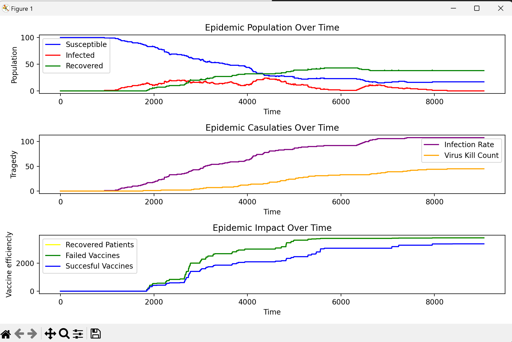
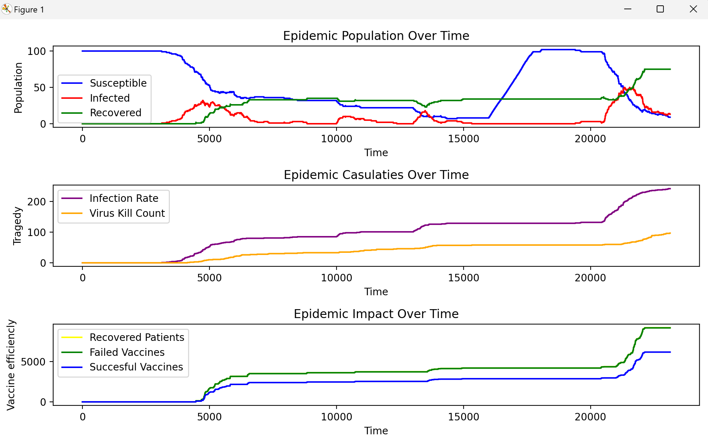
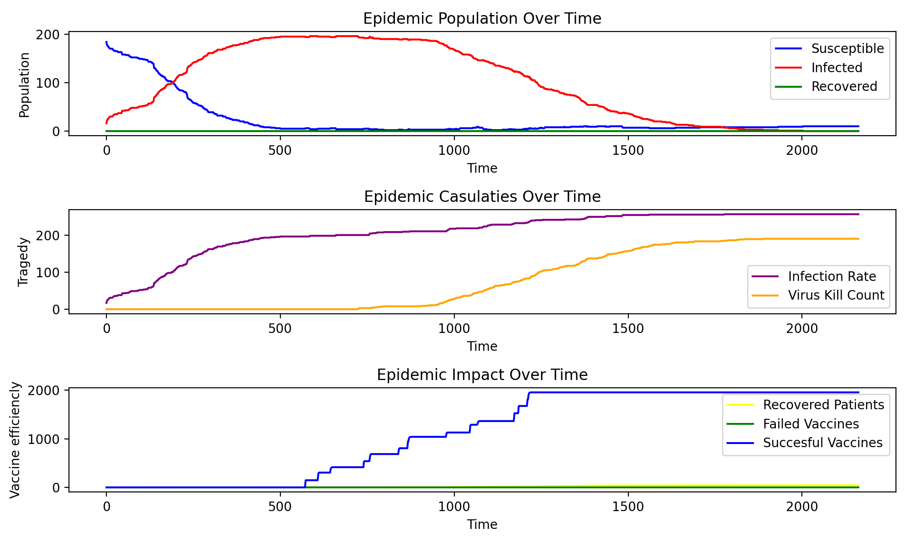
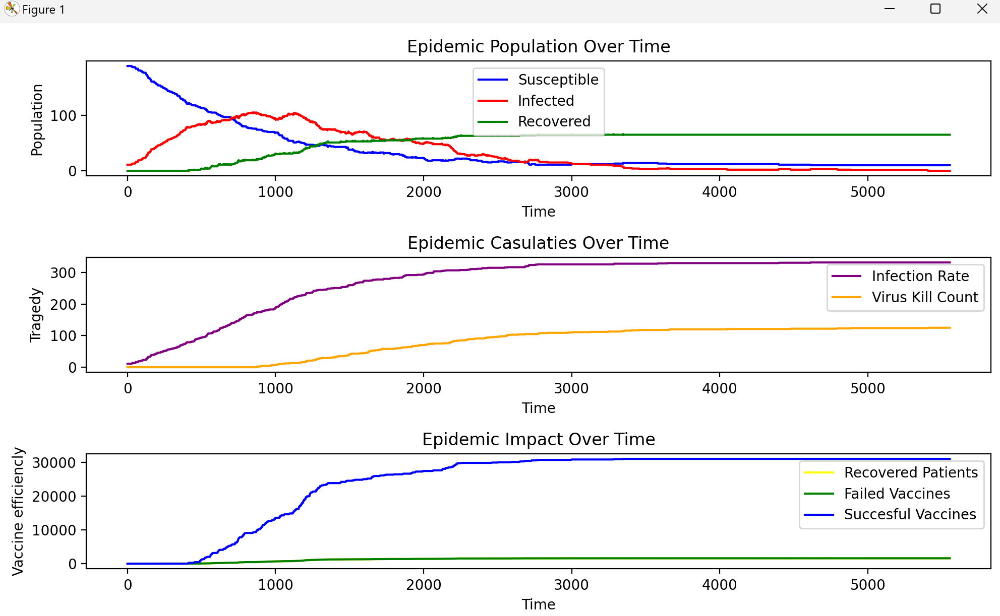
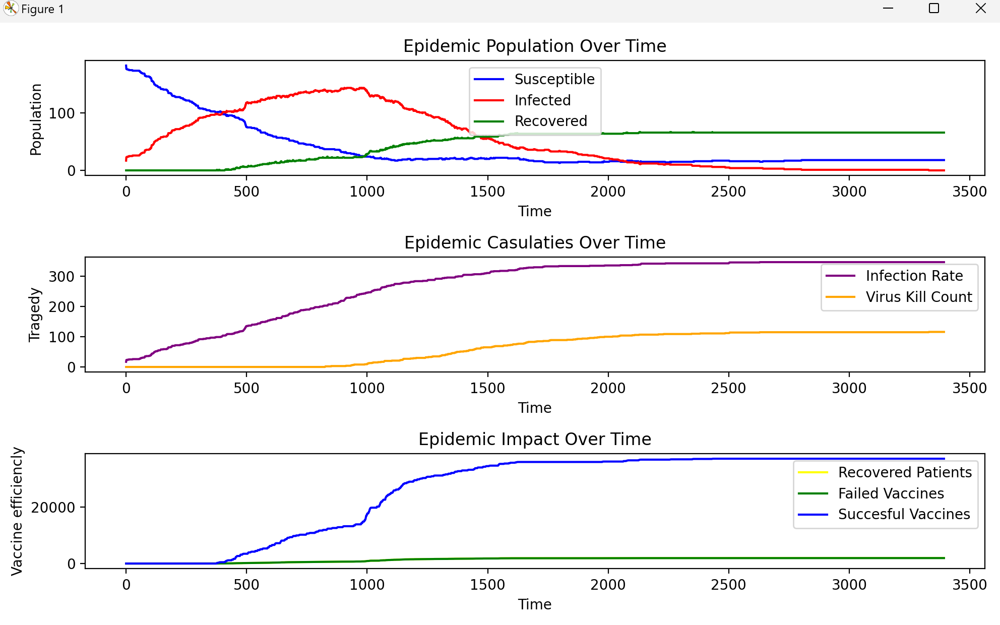

# Disease Spread Model Simulation 

## Overview
- **A SIR agent-based epidemic model simulation**, built using `pygame`. The simulation can be run with default parameters or with real-world data for specific countries.
The simulation provides a visual representation of SIR epidemic dynamics with agent grouping and quarantine mechanism, coupled with parameters adjustable in real-time and other **user controls**.
Beside the pygame window, graphs are plotted concerning the impact of virus spread, vaccination use and also epidemic casulaties.

---

## Contents
- **Scripts**
  - Main simulation script
  - Data extraction script

- **Datasets**
  - Infection and recovery values from: https://www.kaggle.com/datasets/prashant111/coronavirus-daily-counts-data?resource=download&select=Coronavirus+daily+counts.csv
  - Vaccination values from: https://github.com/owid/covid-19-data
  - Reference country population from: https://www.kaggle.com/datasets/iamsouravbanerjee/world-population-dataset/data?select=world_population.csv

---

## Requirements
- Python 3.8+
- `pygame`
- `matplotlib`
- `pandas`
  
---

## Usage

### Running the simulation
 Run epidemic_sim.py
 For switching dataset usage, change **withDataset** in main script

### User Controls
 Z - add susceptible agent
 Q - infect random agent
 R - restart simulation
 0-6 - adjust parameters
 
### Simulation Graphs
1. **Output #1 Basic simulation with naive parameters**

   

2. **Ouput #2 Adding multiple agents before stabilization**

   

3. **Output #3 No vaccines, epidemia wins**

   

5. **Output #3 Documented - France**

   

6. **Output #4 Documented - Taiwan**

   

---

## Acknowledgments

This project is based on the SIR epidemic model and COVID-19 data sources. Visualization inspired by real-world epidemic dynamics:
- Agents vaccinate based on principle: pro-vaxxers will group together and head to the quarantine, while anti-vaxxers will wait for recovery.
- After leaving the quarantine, pro-vaxxers will become anti-vaxxers, regardless of the outcome, in order to avoid infite crowding at the quarantine.
- Failed vaccines leave the agents as Susceptible, while succesful ones make them Recovered. Recovered agents cannot be infected again.
- Agents that do not reach quarantine or wait for recovery, will either become Susceptible or be removed from the simulation.
  
---

